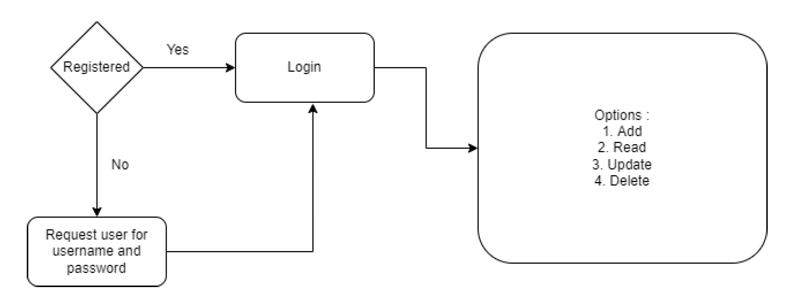

<h1>Problem Statement</h1> 
Create a Digital Phone Book 📞  
<b>Statement</b> 
Create a menu-driven console application similar to old phone book, where multiple users
can create their account,
We have to create an authentication system :
1. Registration
2. Login (If user is already registered)
After successful authentication, user should have right to
1. Add contacts
2. Read all contacts
3. Read any specific contact
4. Update any specific contact
5. Delete any specific contact
Project 2: Problem Statement 2
6. Delete all contacts

 
 
<b>Project Flow</b>
 
 
